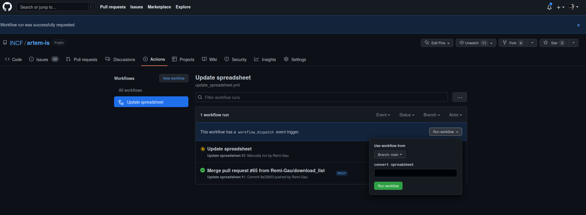
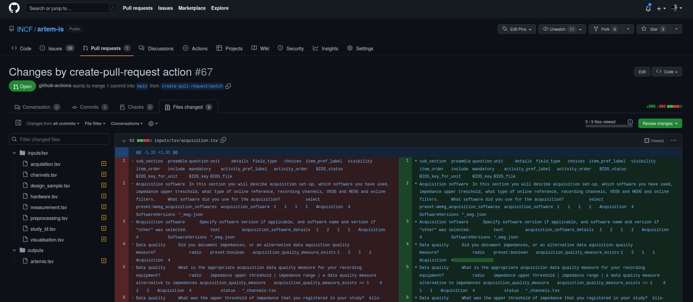
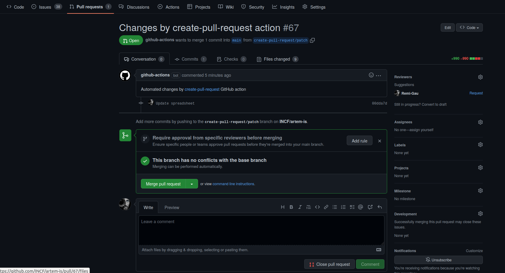

# CONTRIBUTING

## Want to help?

If you want to join this project, please check out our [INCF Working Group](https://www.incf.org/sig/incf-working-group-artem) and apply for joining it by filling in this [form](https://forms.gle/QHFakdGUQ69QrCYc9).

## Contributors

ARTEM-IS is developed by an [INCF working group](https://www.incf.org/sig/incf-working-group-artem), in partnership with [eCOBIDAS](https://www.incf.org/sig/incfohbm-working-group-checklists-transparent-methods-reporting-neuroscience-ecobidas).

A centralized list of the people who contributed to this project can be found [here](https://osf.io/ut9pc/).

## Serve the website locally (on your computer)

### Requirements

- Python

To install all the necessarry packages,
type the following in a terminal in the root of the repository:

```bash
pip install -r requirments.txt
```

### Serve the website

Type the following in a terminal in the root of the repository:

```bash
mkdocs serve
```

## How to update the spreadsheet

There is an automated workflow that will grab the different ARTEMIS spreadsheet
from google drive and merge them into a single spreadsheet.

It can be triggered manually:

- Go to the action tab of the repository (only visible if you are a maintainer of the repository)
- Select the "workflow" you want to run (in this case the "Update spreadsheet" workflow)
- Click on the `Run workflow` dropdown and then on the `Run workflow` button



- Once the workflow has finished, if there are any changes in the content of the spreadsheet,
  the workflow will have opened a "pull-request", that you can view in the `Pull requests` tab.


- You can inspect the changes made in the spreadsheets by opening the pull-request
  and then clicking on the `Files changed` tab.



- If you are OK with the changes, you can approve them by clicking on the `Merge pull request` button
  in the `Conversation` tab.




